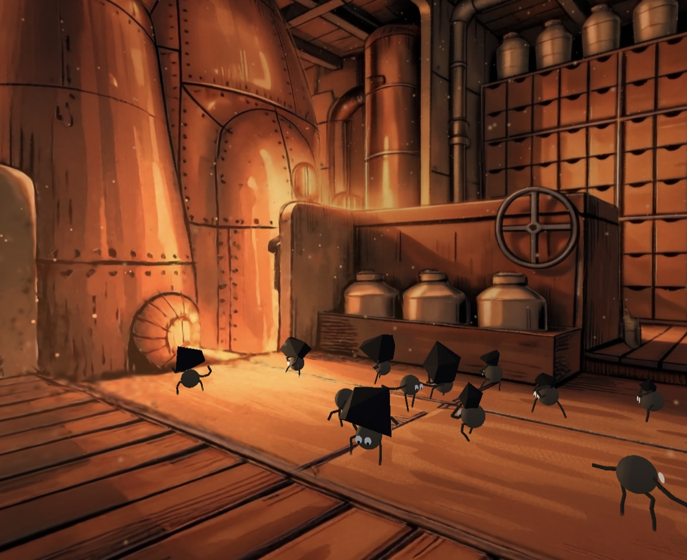
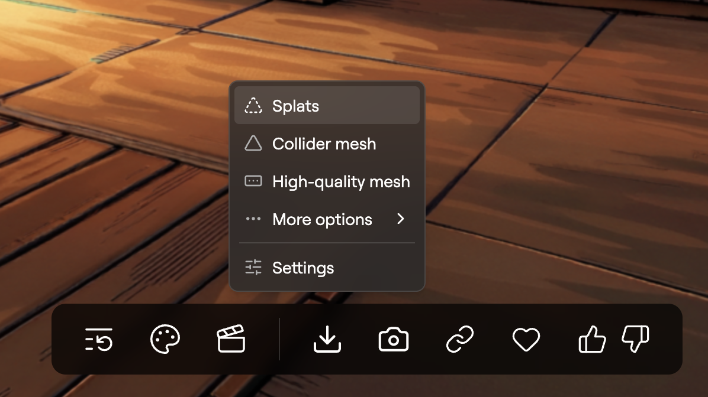

<p align="center">
  
</p>

# the-boiler-room

A Gaussian-splat scene that's *alive*: physics, a navmesh crowd of little coal-hauling creatures, and fire VFX, all running on a [Spark](https://github.com/sparkjsdev/spark) splat in the browser. Fork it as a starter for your own interactive splat worlds.

## Stack

| Layer | Library |
| --- | --- |
| Renderer | [Three.js](https://threejs.org) (`WebGLRenderer`) |
| Gaussian splats | [Spark](https://github.com/sparkjsdev/spark) (`SparkRenderer` + streaming LOD `.rad`) |
| Physics | [crashcat](https://www.npmjs.com/package/crashcat) (rigid bodies + static triangle-mesh collider) |
| Navigation | [navcat](https://www.npmjs.com/package/navcat) (solo navmesh + crowd steering) |
| Math | [mathcat](https://www.npmjs.com/package/mathcat) |
| Binary asset packing | [packcat](https://www.npmjs.com/package/packcat) |
| Language / build | TypeScript + [Vite](https://vite.dev) |
| Lint / format | [Biome](https://biomejs.dev) |

## Quick start

### Requirements

- **Node.js** 24+ (Vite 8, plus native `Float16Array` for the asset build scripts)
- **pnpm** (the repo ships a `pnpm-lock.yaml`; npm/yarn work too)
- A **Rust toolchain** is only needed to build a fresh LOD splat (see [Asset pipeline](#asset-pipeline-from-marble-to-the-browser)), not to run the bundled scene.

### Install & run

```bash
pnpm install
pnpm dev          # http://localhost:5173
```

### Build for production

```bash
pnpm build        # tsc + vite build → dist/
pnpm preview      # serve the production build locally
```

### Lint / format

```bash
pnpm lint         # biome check
pnpm check        # biome check --write (autofix)
```

## How it works

The scene is built up in layers, each one adding to the one below it:

- **A splat world made in Marble.** Spark renders the Gaussian splat, but it's *only* visuals; it has no notion of solid ground or walls. Everything below gives it those.
- **A physics world** (crashcat, `src/physics.ts`). The baked collider (`public/collider.bin`) is loaded as one static triangle-mesh body, so the room is solid. Coal are dynamic rigid bodies that fall, roll, and collide against it.
- **A navigation mesh** (navcat, `src/navigation.ts`). The baked navmesh (`public/navmesh.json`) is rebuilt into a `NavMesh` describing every walkable surface: the floor plan the creatures are allowed to move on. (Both this and the collider above are baked offline from the raw `assets/*_collider.glb`; see [Asset pipeline](#asset-pipeline-from-marble-to-the-browser).)
- **A navcat crowd** for the creatures. It sits on top of the navmesh and steers agents across it with path-following and local avoidance, so they don't clip through walls or pile into each other.
- **The creatures** (`src/creatures.ts`). GPU-instanced bodies, each driven by a crowd agent for *where it walks* and [FABRIK](https://en.wikipedia.org/wiki/FABRIK) arms for *what it reaches*. A behaviour state machine (`seek → grab → carry → throw`, `src/behavior.ts`) loops them between the coal pile and the boiler. Knock one with a click and it drops out of the crowd into a physics ragdoll.
- **The fire.** A single **furnace signal** (`src/furnace.ts`) is the source of truth for "how hot is the fire right now." Throwing a coal in spikes it, and the **lighting**, **heat shimmer**, **dust glow**, and **embers** all read that one value, so every effect swells together.

The loading overlay stays up until splats are genuinely on screen: it watches `SparkRenderer.activeSplats` climb past a fraction of the model's total rather than guessing with a timer (`SPLAT_READY_FRACTION`).

## Asset pipeline: from Marble to the browser

This scene started life in [Marble](https://www.worldlabs.ai/) (World Labs' 3D-world generator). The three assets the browser loads are baked offline from Marble's export, so there's no heavy parsing at runtime.

### 1. Export from Marble

From a generated world, use the download menu to export **two** files:



- **Splats** → a `.spz` Gaussian splat: what you *see*.
- **Collider mesh** → a `.glb` mesh: what physics + navigation *use*. (You don't need the high-quality mesh.)

### 2. Drop them in `assets/`

`assets/` is gitignored and never served; it's just the source for the build steps. Name the pair so they're easy to pass to the scripts, e.g.:

```
assets/
  MyScene.spz
  MyScene_collider.glb
```

### 3. Run the three build steps

Each script takes its input path and writes the served asset into `public/`:

```bash
pnpm build:lod        assets/MyScene.spz           # → public/MyScene-lod.rad   (rendered splat)
pnpm build:collider   assets/MyScene_collider.glb  # → public/collider.bin      (physics)
pnpm build:navmesh    assets/MyScene_collider.glb  # → public/navmesh.json      (navigation)
```

| Script | Input (from Marble) | Output (served) | Used by |
| --- | --- | --- | --- |
| [`scripts/build-lod.sh`](scripts/build-lod.sh) | `*.spz` splat | `public/*-lod.rad` | `SplatMesh` in `src/index.ts` |
| [`scripts/build-collider.ts`](scripts/build-collider.ts) | `*_collider.glb` | `public/collider.bin` | `src/physics.ts` |
| [`scripts/build-navmesh.ts`](scripts/build-navmesh.ts) | `*_collider.glb` | `public/navmesh.json` | `src/navigation.ts` |

> **Heads up: `build:lod` needs Rust.** It runs Spark's `build-lod` tool, which ships only in the Spark *source* repo, so the script shallow-clones Spark (pinned to the version this project depends on) into a gitignored `vendor/` dir and runs it via `cargo`. Install a [Rust toolchain](https://rustup.rs/) for this step. The collider and navmesh steps are pure Node.

## Template customization

Everything specific to this scene lives in one file, **[`src/scene.ts`](src/scene.ts)**. Once your assets are built (above), update these to match your world:

| Constant | What it is |
| --- | --- |
| `SPLAT_URL` | Your `.rad` from the asset pipeline (`COLLIDER_URL` / `NAVMESH_URL` keep their default filenames). |
| `CAMERA_POSITION` / `CAMERA_TARGET` | Where the camera starts and looks. |
| `FIRE_ORIGIN` | The boiler fire (drives lighting, heat shimmer, and dust). |
| `CLUMP` / `DROPOFF` / `BOILER` / `SPARK_ORIGIN` | Landmarks for the coal-hauling loop. |
| `FLOOR_Y` | Floor height; coal that falls below it is recycled. |

The per-effect *feel* (fire swell, shimmer strength, particle counts, behaviour timing) isn't scene-dependent, so it stays as named constants at the top of each system file (`furnace.ts`, `heat.ts`, `lighting.ts`, `dust.ts`, `sparks.ts`, `behavior.ts`). That's the look you keep regardless of geometry.

## Version notes

- **Spark is pinned** (`@sparkjsdev/spark` + the `SPARK_VERSION` in `build-lod.sh`) so the LOD `.rad` format matches the runtime. If you bump Spark, rebuild your `.rad`.

## License

Licensed under the [MIT License](LICENSE).
